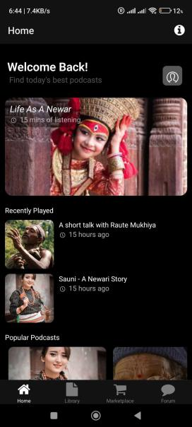
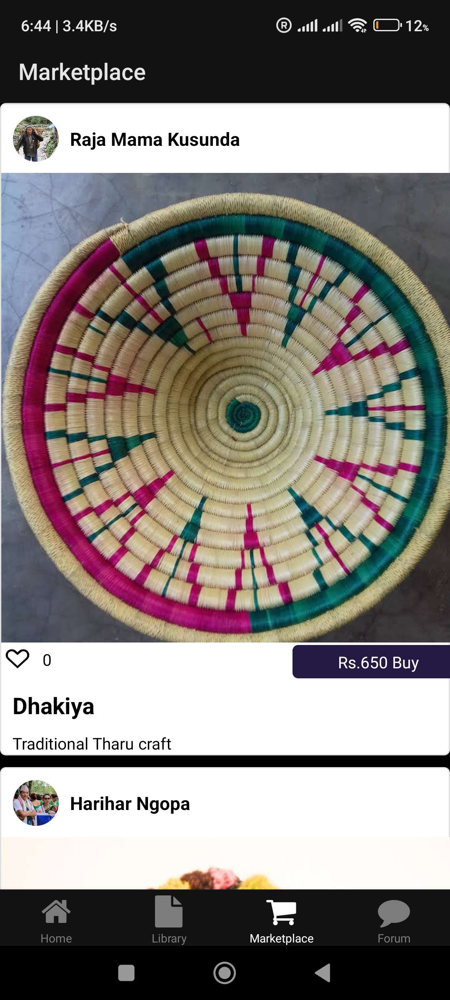

# Native Tunes 
### Listen in your Language

<br>

A comprehensive solution for farmers and people who want to grow on land, which aims to empower farmers by educating them & helping them make imformed decisions that increases their income.

Agrify aims to act as a brigde between agriculture and technology. Our aim is to make farming not seen as an option of last resort, but rather a vacation of choice.

## Contributors 👨‍💻
```
Krishant Timilsina          (@krishtimil)
Apil Chaudhary              (@tryo-apil)            
Bindu Paudel                (@bigya01)
Bishal Panta                (@bishal0601)
```

## Tech Stack Used

The project used .NET for backend and React Native for frontend. Backend is exposed at a Azure point.

View api docs [here](https://nativetunes.azurewebsites.net/swagger/index.html).
<!-- <br>
<center>
<br> -->

## Screenshots
<p float="left">
   
  
  
  


</p>
</center>


## 🔨 Build

###  📋 Requirements

To setup and use the project you will need to have the following tools installed:
 - [NodeJs & npm](https://nodejs.org/en)
 - [dotnet](https://dotnet.microsoft.com/en-us/download)

###  ⬇️ Installation

Clone the repository

```bash
$ git clone https://github.com/krishtimil/native.git
```

## Frontend
Change the working directory to the newly cloned repository:

```bash
$ cd nativetunes/frontend
```

Run `npm install` to install the dependencies :

```bash
$ npm install
```

Start and natively compile the project using expo:

```bash
$ npx expo run:android
```
or for ios :
```bash
$ npx expo run:ios
```
